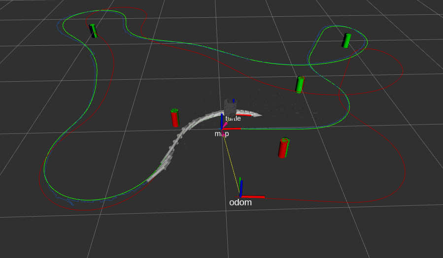
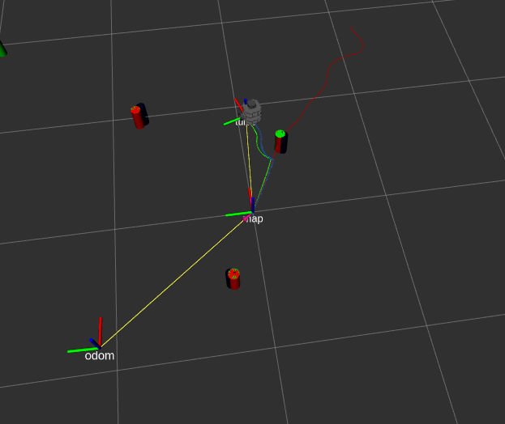

# Feature-Based Kalman Filter SLAM and Feature Detection through Circle regression
* Implementation of the Feature-Based Kalman Filter SLAM
* Visualization of SLAM estimated robot trajectory (blue) and odometry-only trajectory (red) in rviz
* Visualization of SLAM estimated landmarks (blue) in rviz
* Compatible with nurtlesim simulation or with real turtlebot
* Detection of obstacle tubes from radar scan data through regression
* Use either known or unknown data association for SLAM
# Example Usage and results
1. Known data association
```
roslaunch nuslam slam.launch robot:=localhost
```

* Green path: the real path of the simulated robot
* Blue path: the estimated path through SLAM, approximately matches the real path
* Red path: the estimated path through odometry only, does not match the real path
* Turtle frame: the real pose of the robot
* Map frame to odom frame: the corrections to the pose estimate through SLAM
* Green markers: the real position of the obstacles in space
* Red markers: the current position of the obstacles in space sensed by the robot (far obstacles do not have red overlap since they may be outside of the sensing range)
* Dark blue markers: the position of the obstacles in space estimated through SLAM


* Shows approximately matching real path and SLAM path at the beginning of the simulation, while the odometry path is different due to the robot wheels moving during the collision

2. Detection of landmarks through laser scan data
```
roslaunch nuslam landmark_detect.launch simulate:=true
```

3. Unknown data association simulation
```
roslaunch nuslam unknown_data_assoc.launch robot:=localhost
```

GIF is at 4x speed. When the simulated robot approximately reaches its initial pose (0,0,0):
* Final pose according to SLAM: (x,y,theta) = (0.009, -0.049, 0.032)
* Final pose according to odometry only: (x,y,theta) = (0.047, -0.994, 0.047) 

4. Unknown data association on the turtlebot
```
roslaunch nuslam unknown_data_assoc.launch robot:=turtlebot.local
```

