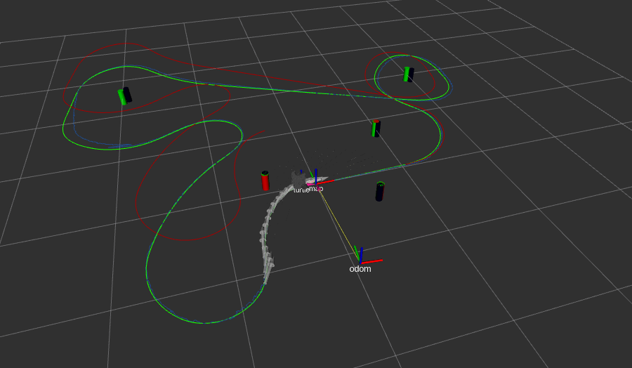

# Feature-Based Kalman Filter SLAM
* Implementation of the Feature-Based Kalman Filter SLAM
* Visualization of SLAM estimated robot trajectory (blue) and odometry-only trajectory (red) in rviz
* Visualization of SLAM estimated landmarks (blue) in rviz
* Compatible with nurtlesim simulation or with real turtlebot
# Example Usage
```
roslaunch nuslam slam.launch robot:=localhost
```


