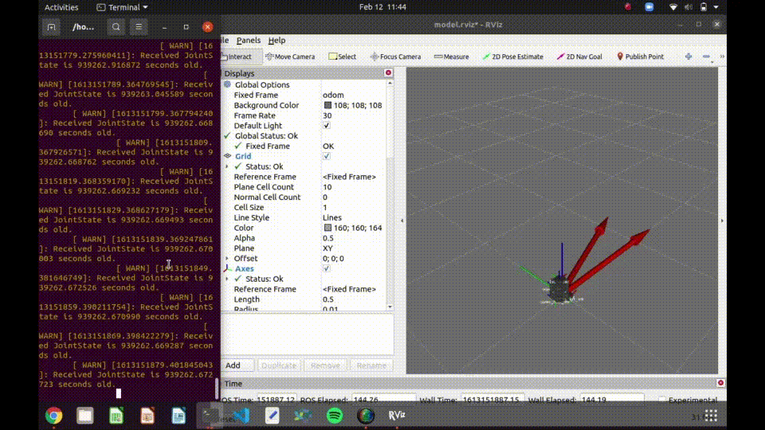
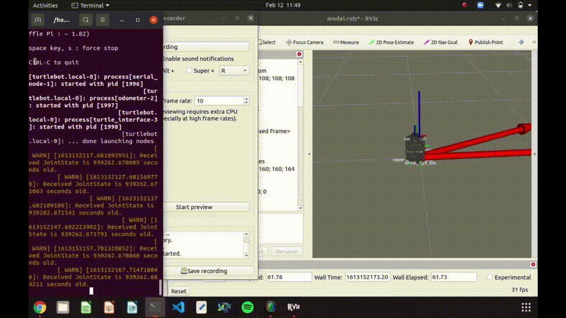

# nuturtle_robot
* A package that contains code to interact with the turtlebot hardware and run nodes on the turtlebot from a computer
* Contains low-level control and sensor routines for the robot
* Can make the turtlebot follow a circular trajectory
# Example Usage
* Allow launching nodes remotely
```
roslaunch nuturtle_robot basic_remote.launch robot:=turtlebot.local
```
* Make the robot follow a circular clockwise trajectory
```
roslaunch nuturtle_robot odom_teleop.launch follow_circle:=true
rosservice call /control 1
```
* Control the robot from the command line
```
roslaunch nuturtle_robot odom_teleop.launch follow_circle:=false
```
* Linear motion - final odometry pose is x = 0.0035 m, y = -0.0001 m, theta = 0.015


* Rotational motion - final odometry pose is x = -0.0005 m, y = -0.0032 m, theta = 0.001


