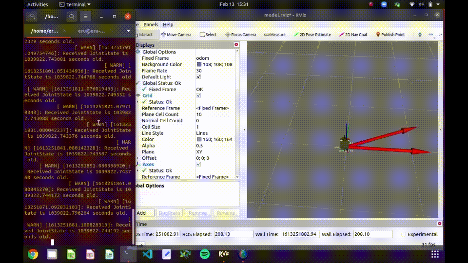

# nuturtle_robot
* A package that contains code to interact with the turtlebot hardware and run nodes on the turtlebot from a computer
* Contains low-level control and sensor routines for the robot
* Can make the turtlebot follow a circular trajectory
# Example Usage
* Allow launching nodes remotely
```
roslaunch nuturtle_robot basic_remote.launch robot:=turtlebot.local
```
* Make the robot follow a circular clockwise trajectory
```
roslaunch nuturtle_robot odom_teleop.launch follow_circle:=true
rosservice call /control 1
```
* Control the robot from the command line
```
roslaunch nuturtle_robot odom_teleop.launch follow_circle:=false
```
All demo gif are shown at 2x speed

* Linear motion - final odometry pose is x = 0.0035 m, y = -0.0001 m, theta = 0.015


* Rotational motion - final odometry pose is x = -0.0005 m, y = -0.0032 m, theta = 0.001


* Circular motion - final odometry pose is x = 0.0088 m, y = 0.0004 m, theta = -0.019


* Manually controlled motion - final odometry pose is x = 0.0293 m, y = -0.0064 m, theta = -0.078
Manually driving the robot to make it trace a circle was more challenging and led to a less accurate final position (compared to the initial 0 0 0) because of the discretization of the wheel speeds sent by the teleop command line gui and because the rotational and linear components of the robot body twist have to be controlled simultaneously and match each other to trace a good circle.


